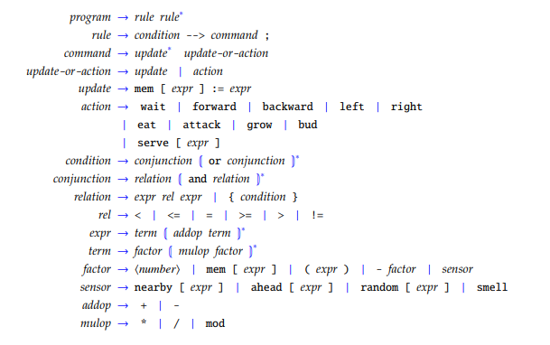
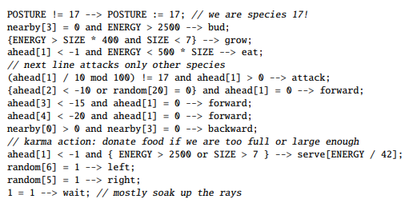

# CritterWorld

I recently saw a YouTube video where a number of generative AIs were put through an introductory CS course at Cornell University. The video was very interesting, but one of the most interesting things was one of the assignments from the class. For the final project in this class, the students created an artificial life simulation. The simulation had a world populated by "critters." The critters' behaviors were described by their genome, which was represented in a simple programming language. The program could be mutated when the critter reproduced and there were rules to ensure that the mutated genome remained valid. 

I have been interested in artificial life for a long time. I read [Steven Levy's *Artificial Life: A Report from the Frontier Where Computers Meet Biology*](https://www.amazon.com/Artificial-Life-Frontier-Computers-Biology/dp/0679743898/) back in the early 90s. I was in college, I had either just changed my major to computer science or was perhaps still just considering it. I was fascinated by the idea that life is a property of organization and not of biology, and that if this is true, why can´t a computer program be consider alive? I remember reading about [Conway's Game of Life](https://en.wikipedia.org/wiki/Conway%27s_Game_of_Life), and about how the complicated flocking behaviors of birds could be explained by simple rules that relied only on each bird responding to his immediate neighbors. Later, I encountered the [Core War](https://en.wikipedia.org/wiki/Core_War) game and how some of these warrior programs used genetic algorithms and would evolve.

I have been working through the [boot.dev](https://boot.dev/) curriculum to try and breathe some life into my atrophied coding chops. I have hit the point in the course where you pick your own project, so I have decided that I will implement CritterWorld, or at least a piece of it. The idea for this project is to building something in the absence of a tutorial and on the order of 20-40 hours of work. The CritterWorld assignment has a specification, but not a tutorial. The scope of work is significantly larger, though. It's an approximately 3 month long project and it looks like it is done in teams of 2-4. It is however broken down into four sub-parts, so I am going to begin by tackling the first sub-part - a parser, pretty-printer, and fault-injector for the critter genome language. Once I get through that, I'll see about continuing on to the next part - an interpreter for the critter genomes, a simulator for the critters in their environment, and a console interface for interacting with the simulation. Part 3 is to put a GUI on top of the simulation. Finally, in part 4, the simulator is moved to a client-server model, with the simulation able to interact with multiple clients over the network simultaneously. We'll see how far I get.

## What is CritterWorld?

CritterWorld, as imagined in the Cornell CS2112 class, is an Artificial Life simulation. The simulation consists of a world described by a hexagonal grid. Hexes in the world can be empty or can be occupied by a rock, some food, or by a critter. Rocks represent impassible, indestructible barriers. A critter may consume food that is sitting in the hex in front of it. Food provides the critter with energy for all of the things necessary for survival and reproduction, from simply existing to attacking other critters and reproducing.

Formal Definition of the Critter Genome

Critter behavior is controlled by a genome that is described by a simple programming language. A critter genome consists of a number of rules, each rule consisting of a condition and a command block that executes if the condition is true. Each critter, on its turn, starts at the top of its list of rules and begins checking the conditions. It will execute the command block for the first true condition that it encounters. A command block consists of a number of commands, where each command is either an instruction to update a location in the critter's memory or to perform an action (such as moving or eating). Command blocks can contain multiple update commands, but may have at most one action command and it must be the final command in the command block. When the critter encounters a true condition and executes the command block, its turn is over if it executed an action as part of the command block. Otherwise, it begins examining its rules from the top again. A critter keeps checking for valid conditions until it has examined MAX_RULES_PER_TURN (by default 999) or until it has taken an action, at which point its turn ends and the next critter begins its turn.

When a critter reproduces, it passes on its genome to its offspring. However, there is a chance that a mutation will occur in the genome of the offspring. If the mutation turns out to be beneficial, then this new genotype should produce more offspring than the original genotype. With enough turns in the simulation, we should get to see evolution in action, with critters finding more and more effective strategies for successfully passing on their genome.

The Proto-Critter Genome

A complete description of the critter genome, the ways the genome can mutate, and the simulation is available in [project.pdf](specification/project.pdf). This is the document provided to students in the Cornell CS2112 class to guide the development of the project and which I am using as my guide as well. There are a number of places where I am deviating from the original specification. For example, the students develop their project in Java. I was originally using Python, as one of my goals for the project is to lean more about development with Python. The project is now moving over to Go. I have completed the [boot.dev](https://boot.dev/) curriculum involving Python and the remained of the curriculum involves Golang. Go is also probably a better fit for the project overall, at least in so far as I understand Go. For example, I believe that I may be able to take advantage of  Go's concurrency support. Critters could possibly be implemented using goroutines, passing messages to the simulator for actions they wish to take or requests for information about the environment, for example. Phase 4 of the project, as originally imagined in the Cornell CS2112 assignment involves moving the simulator architecture to a Client/Server system where multiple clients can potentially interact with the simulation over a network. I believe that using Go will possibly make that easier. Or maybe not, but there is one way to find out! The original Python-based implementation will continue to reside [critter-world](https://github.com/FooWho/critter-world). This repository will be where future development occurs.

I made a slight change to the way random values are selected when a mutation is changing a numerical value in the critters genome. There are also areas where the specification is deliberately ambiguous and students are encouraged to make their own judgments. I have attempted to document all of the assumptions that I made in the source code, though I am certain there are probably some places I failed to do so or did not thoroughly explain my assumption. Hopefully, I will correct those as time goes on. 

## Phase 1v2

Phase 1 was completed in Python, but I am now working on a Go implementation. So far, nothing has been moved over but the README. The first step will be to reimplement the lexer, then I will recreate the AST structure, then the parser, and finally the mutator.

### How to install and use Phase 1.
As of this writing, there is nothing to install or use yet for the Go version. Stay tuned for updates...

## Phase 2
The next phase in the project is to implement an interpreter for the critters and a simulator for the world with a console interface for interacting with it.

## Phase 3
The third phase in the project is to build a graphical user interface for the simulation.

## Phase 4
The fourth and final phase is to separate the simulation from the interface, with the simulation running as a web service that allows multiple clients to connect and interact with the simulation.

